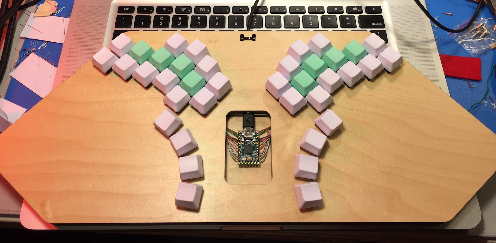
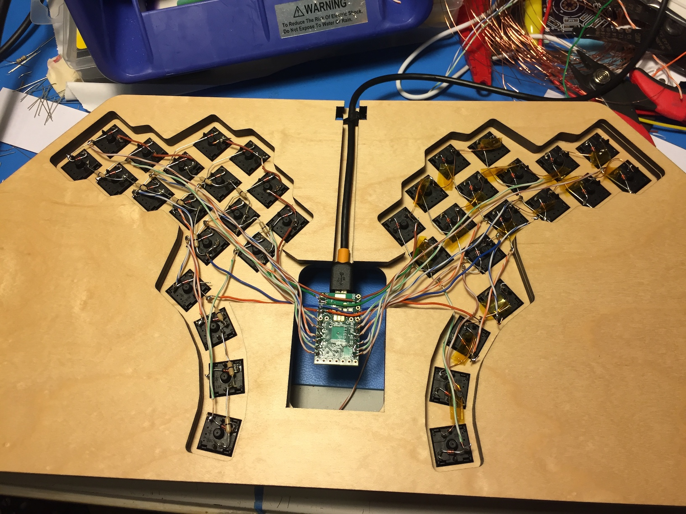
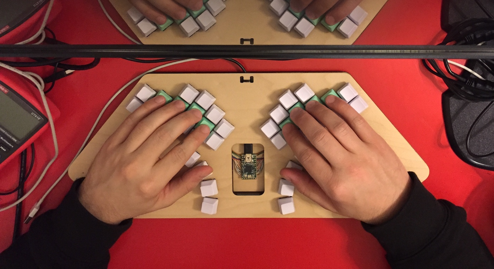
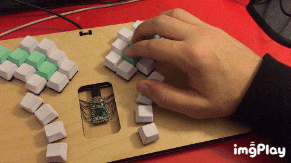
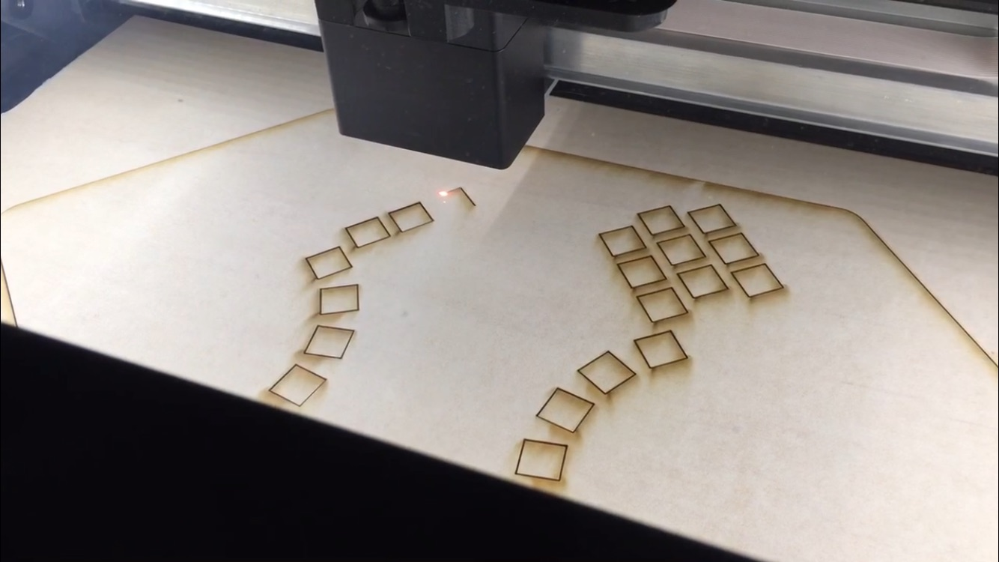
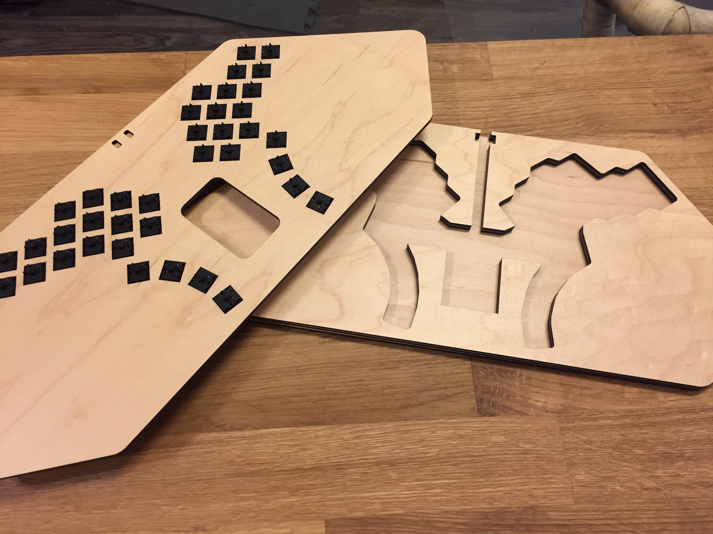
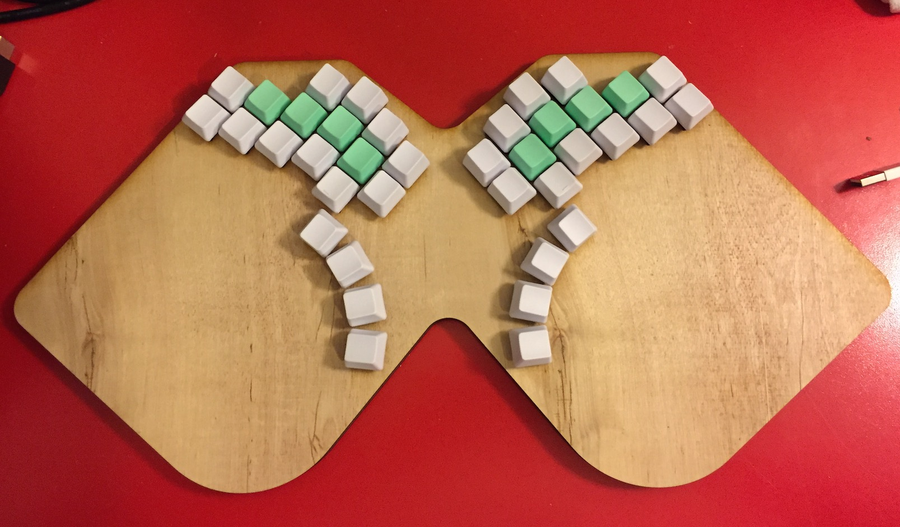

# hexon38

The hexon38 is a custom 38-key keyboard.

UPDATE: for initial work-in-progress QMK firmware, see https://github.com/qmk/qmk_firmware/pull/4709

## Revision 1

This keyboard is a one-off, hand-wired prototype:

The forearm-to-forearm angle is 80 degrees, which accomodates a sitting style where the keyboard is about a foot away from your chest.

The thumb arch makes better use of the thumb:

The frame is laser cut from maple ply:

### Revision 1 design files:

- CorelDraw: [hexon38-r1.cdr](hexon38-r1.cdr)
- PDF export of CorelDraw sheets: [hexon38-r1.pdf](hexon38-r1.pdf)

## Revision 0

This was the first revision of this design:

### Revision 0 design files:

- CorelDraw: [hexon38-r0.cdr](hexon38-r0.cdr)
- PDF export of CorelDraw sheets: [hexon38-r0.pdf](hexon38-r0.pdf)

## Inspiration

This keyboard was inspired by many similar designs, primarily the lil38.

See [inspiration.md](inspiration.md).

## Links
- https://geekhack.org/index.php?topic=98647.0
- https://www.reddit.com/r/MechanicalKeyboards/comments/a6xdtr/ready_for_firmware/
