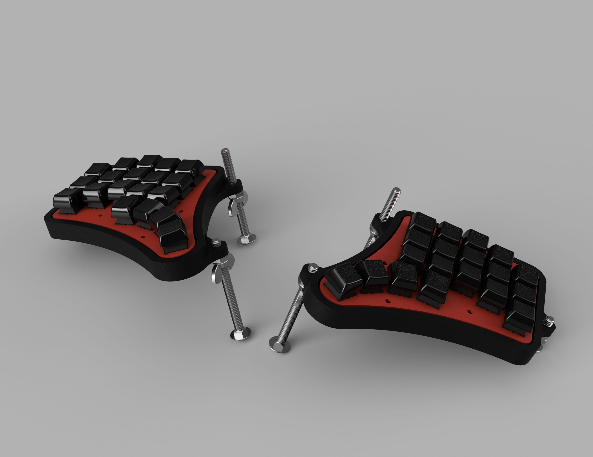
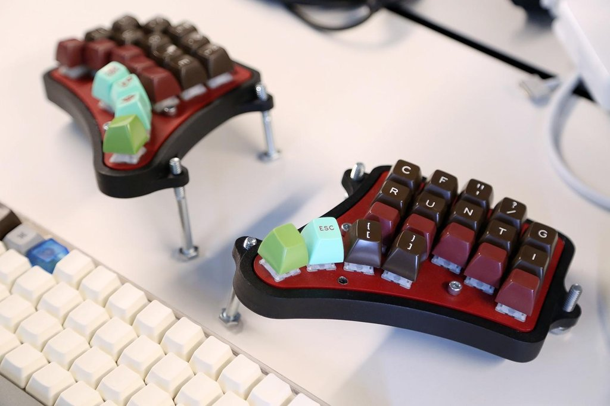
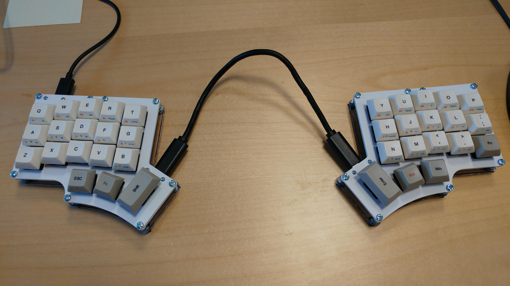
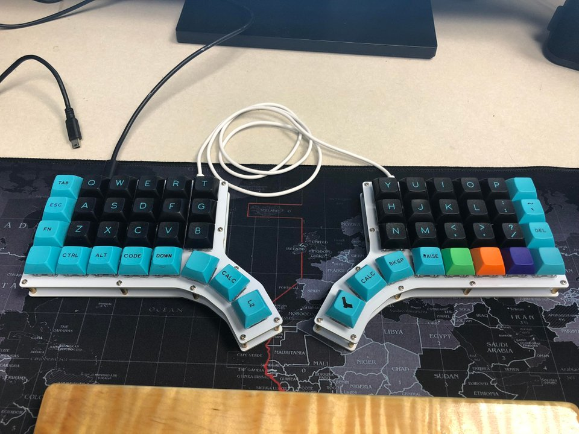
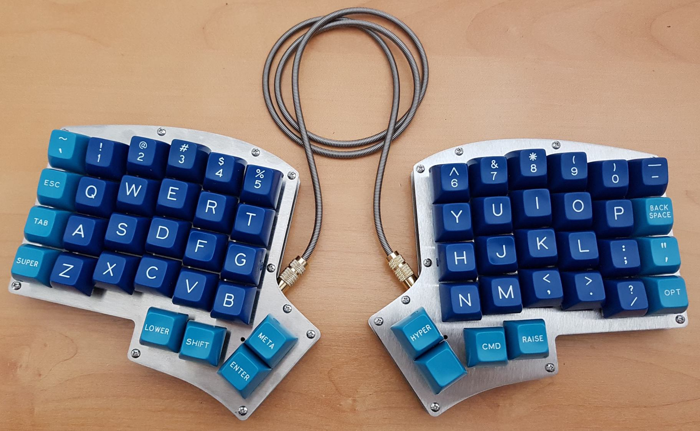
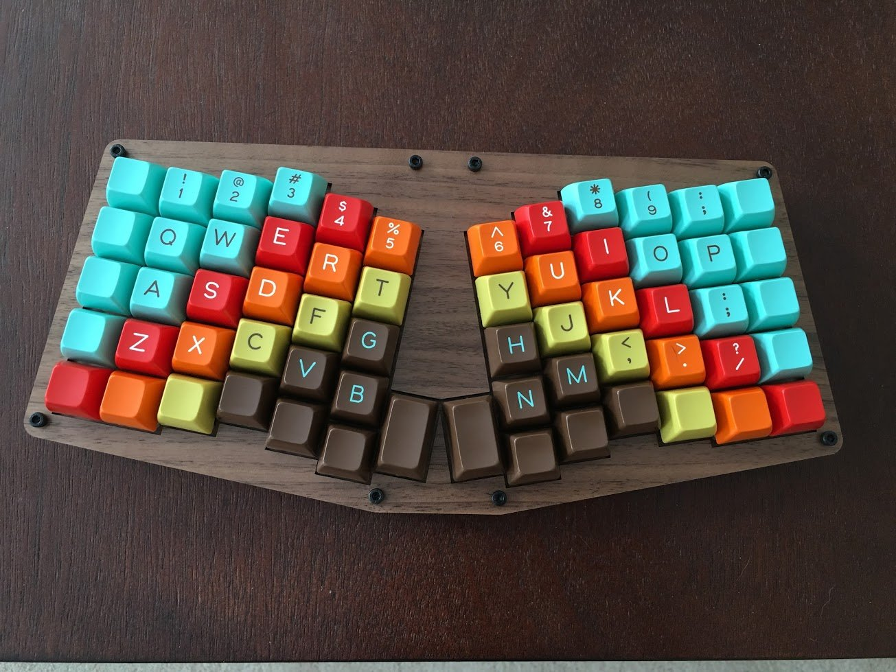
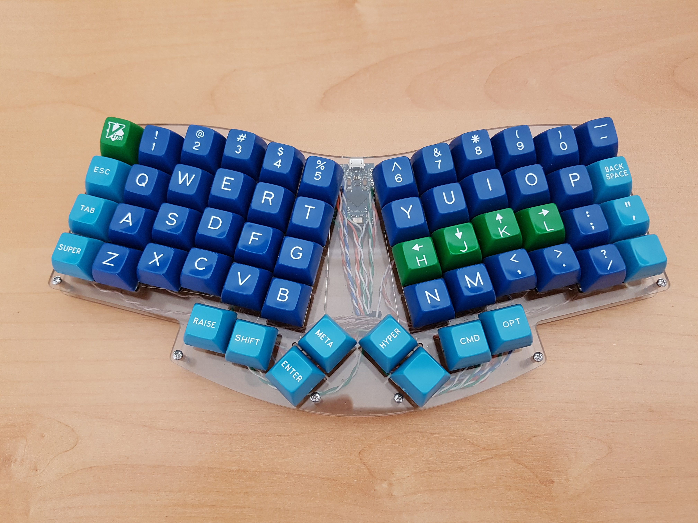
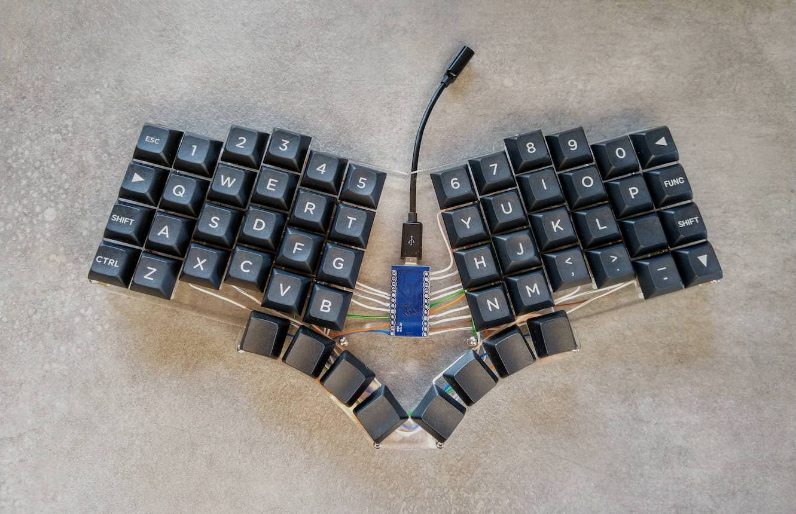
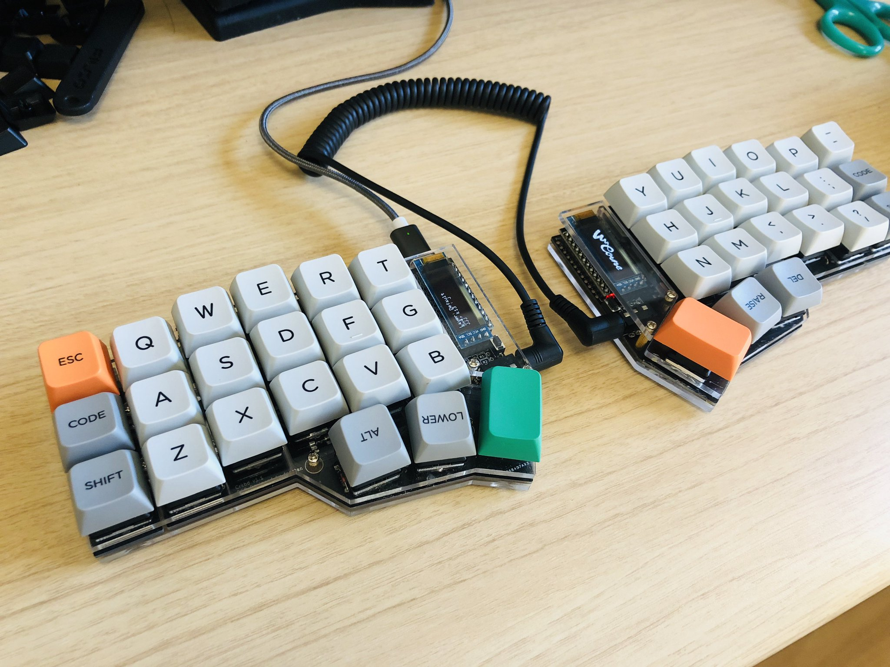

# Inspriation

## lil 38

u/Dotdash32's prototype is gorgeous and is *very* close to what I wanted.

https://github.com/dotdash32/Cases/tree/master/Lil%2038

I asked about this board (using a reddit account which I have lost the password to!) and Dotdash32 gave me [https://old.reddit.com/r/MechanicalKeyboards/comments/9y49go/can_anyone_identify_this_keyboard/e9zjq1k/](some additional details about it).

## minidox

u/That-Canadian's miniature version of the ErgoDOX.

* https://www.reddit.com/r/MechanicalKeyboards/comments/6e7yya/gb_minidox_pcb_group_buy_now_open/
* http://www.keyboard-layout-editor.com/#/gists/87b8d71281d69ae89b2ec418272f25fb
* https://github.com/That-Canadian/MiniDox_PCB

## Rorschach

By u/bakingpy.

* https://www.reddit.com/r/MechanicalKeyboards/comments/8plqu4/rorschachs_legacy/

## Iris

## Atreus

## Atreis

## Pteron

## crkbd

